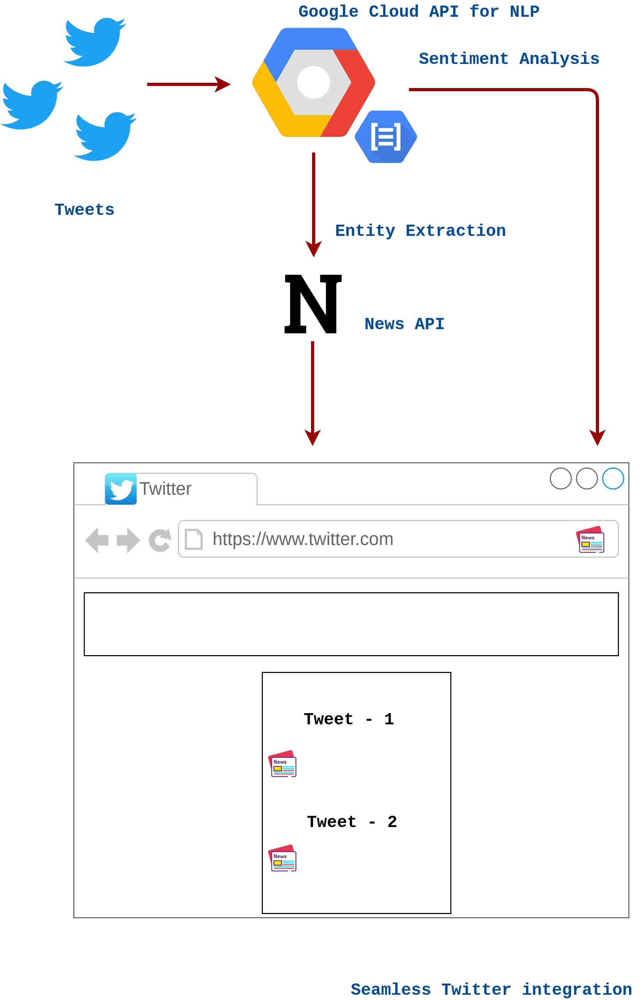
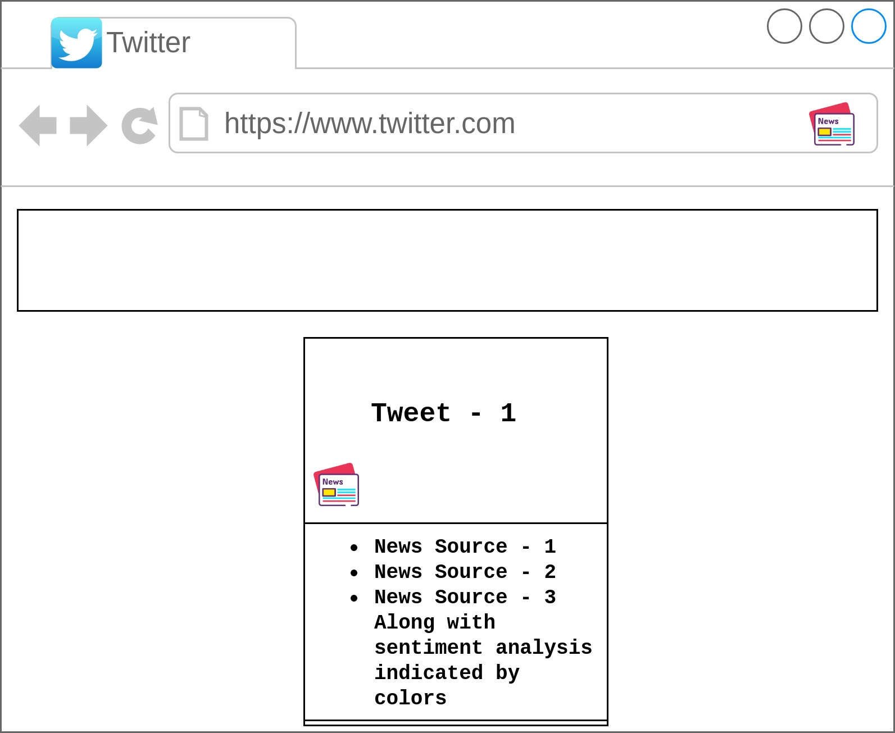
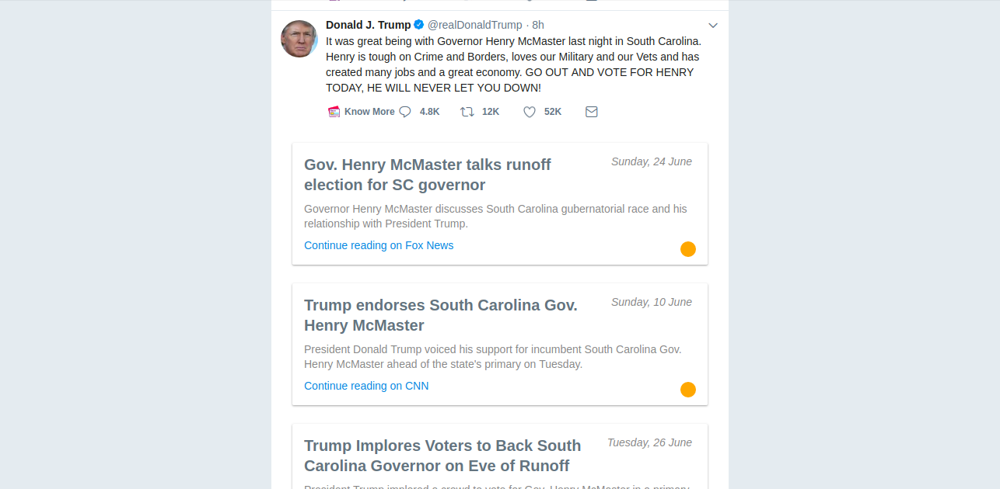

# KnowMore-Server


Our Natural Language Processing pipeline performs entity and topic extraction from tweets to search for news articles from reliable sources and discover Wikipedia articles. We combine this information with sentiment analysis signals for the tweet as well as the news articles to select articles which have a different perspective from the tweet. It is properly and seamlessly integrated into the Twitter UI.

## Installation

### Server

* First clone the repository `https://github.com/sayak119/KnowMore-Server`

* Obtain the required credentials for the Twitter API, News API and Google Cloud Natural Language API.

* Then execute the following command
```python
pip3 install -r requirements.txt
python3 server.py
```

### Client

For Client (Chrome extension) visit [Know More Client](https://github.com/sayak119/KnowMore-Client).

## Flow Diagram



## Mockup

Green is for agreeing with the article, yellow for neutral and red is for diagreeing with the article.



## Working



## YouTube video

[Demo Video](https://youtu.be/xZpOr3u1WFk)
